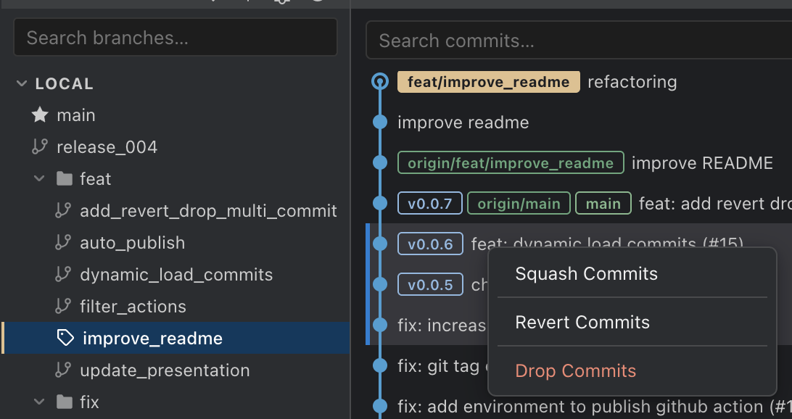

# Git Lean

**A minimalist Git extension for Visual Studio Code.**

Built out of frustration with bloated Git GUIs. Git Lean does less, on purpose: no tabs, no toolbars, no settings pages. Just the branch list and the commit graph, side by side.

Git is a great tool, and this extension covers the everyday workflow for most developers. For anything beyond that, the terminal is your best friend, not 300 buttons crammed into the IDE.

---

## Features

### Branch Panel

A clean sidebar listing all local and remote branches.

- The active branch is highlighted with a distinct icon and `✓` marker
- **Click** a branch to filter the commit graph to its history
- **Ctrl/Cmd+click** to toggle individual branches into a multi-selection; **Shift+click** to select a range
- **Right-click** a branch for quick actions:
  - Checkout
  - Delete
  - Create new branch from here
  - Rebase current branch onto this
  - Merge into current branch
- **Right-click** a multi-selected set of branches to delete them all at once
- **Right-click** a folder to delete all branches inside it
- Pull, push, and force-push controls in the panel toolbar

### Commit Graph

A canvas-rendered git graph visualising your repository's full commit history.

- Multi-lane graph with colour-coded branch lines
- Ref badges inline with each commit — HEAD, local branches, remotes, tags
- HEAD commit rendered with a distinct ring marker
- Filter the graph by selecting a branch in the panel
- **Click** a commit to select it; **Shift-click** to select a range
- **Right-click** a single commit to:
  - View full commit details (diff, author, dates)
  - Copy commit hash
  - Cherry-pick
  - Revert
  - Reset to this commit (soft / mixed / hard)
  - Edit commit message inline

- **Right-click** a selected range of commits to:
  - Interactive rebase — reorder commits by dragging, and set a per-commit action: pick, reword, squash, fixup, or drop
  - Squash into a single commit
  - Cherry-pick the entire range

## Why

Most Git extensions for VS Code are either too heavy or too opinionated. I wanted something that stays out of the way.

The final straw was multi-commit operations. Squashing a range of commits directly from the graph, without dropping to the terminal, isn't available in Git Graph, isn't in the built-in VS Code Git support, and appears to be locked behind GitLens Pro. I could not live with that.

---

## Requirements

- Visual Studio Code **1.75.0** or later
- Git installed and available in your `PATH`
- An open folder that is a Git repository

---

## Getting Started

1. Install **Git Lean** from the VS Code Marketplace
2. Open a folder that contains a Git repository
3. Click the **Git Lean** icon in the Activity Bar to open the panel
4. The **Branches** view and **Commit Graph** appear side by side

> **Tip:** Click any branch in the Branches panel to filter the graph to that branch's history.

---

## Extension Settings

Git Lean has no configuration settings — everything works out of the box.

---

## Tech

Built with the [VS Code Extension API](https://code.visualstudio.com/api), TypeScript, React 19, and the Canvas API for graph rendering. No external runtime dependencies.

---

## Contributing

Contributions are welcome. See [CONTRIBUTING.md](CONTRIBUTING.md) for development setup, architecture notes, and the pull request process.

---

## License

See [LICENSE](LICENSE) for terms.
